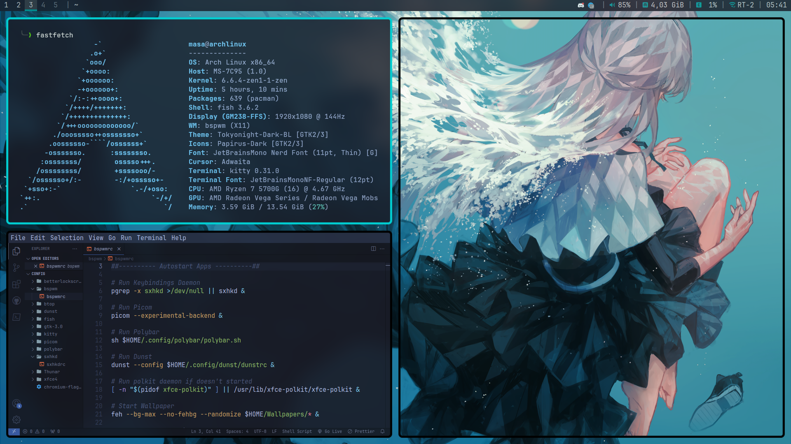

# BSPWM ARCH

<p align="center">
  
</p>

My **BSPWM** Configuration files

## Infomation

|       OS       |                    [Arch Linux](https://archlinux.org/)                     |
| :------------: | :-------------------------------------------------------------------------: |
|   AUR Helper   |                     [yay](https://github.com/Jguer/yay)                     |
|     Shell      |                       [Fish](https://fishshell.com/)                        |
| Window Manager |                [BSPWM](https://github.com/baskerville/bspwm)                |
|   Compositor   |             [Picom Junaburg](https://github.com/jonaburg/picom)             |
|      Bar       |                [Polybar](https://github.com/polybar/polybar)                |
|      Menu      |                [dmenu2](https://github.com/muff1nman/dmenu2)                |
|    Terminal    |                [Kitty](https://github.com/kovidgoyal/kitty)                 |
|  File Manager  |        [Thunar](https://archlinux.org/packages/extra/x86_64/thunar)         |
|    Browser     |      [Chromium](https://archlinux.org/packages/extra/x86_64/chromium)       |
|  Text Editor   | [VS Code / nano](https://aur.archlinux.org/packages/visual-studio-code-bin) |

## Installation

### AUR Helper

The initial installation of Yay

```sh
pacman -Syu --needed nano git base-devel
git clone https://aur.archlinux.org/yay.git && cd yay
makepkg -si
```

#### MAKEPKG

Speed up compiling of AUR packages

```sh
sudo nano /etc/makepkg.conf

MAKEFLAGS="-j8"
```

#### Pacman setting-up

Parallel downloading of packages

```sh
sudo nano /etc/pacman.conf

ParallelDownloads = 5
```

---

#### Installing packages

> Assuming your **AUR Helper** is [yay](https://github.com/Jguer/yay).

```sh
yay -S --needed \
  xorg xorg-xinit xorg-xrdb \
  bspwm sxhkd polybar dmenu2 feh kitty fish dunst betterlockscreen \
  acpid brightnessctl \
  thunar xdg-user-dirs xfce-polkit tumbler lxappearance-gtk3 \
  visual-studio-code-bin nano \
  mpv ffmpeg ffmpegthumbnailer \
  telegram-desktop qbittorrent discord chromium \
  fastfetch btop lsd fzf fd bat maim xdotool xclip reflector \
  p7zip zip unrar unzip \
  ttf-jetbrains-mono-nerd noto-fonts noto-fonts-emoji noto-fonts-cjk papirus-icon-theme \
  mesa mesa-utils lib32-mesa vulkan-intel lib32-vulkan-intel vulkan-icd-loader lib32-vulkan-icd-loader \
  bluez bluez-utils sof-firmware \
  && fc-cache -fv
```

Picom Compiling

```sh
git clone https://github.com/jonaburg/picom && cd picom
meson --buildtype=release . build
ninja -C build
# To install the binaries in /usr/local/bin (optional)
sudo ninja -C build install
```

#### Copy configuration files

```sh
# /.config
mkdir -p $HOME/.config && cp -r $HOME/arch_bspwm/config/* $HOME/.config
# /.local/bin
mkdir -p $HOME/.local/bin && cp -r $HOME/arch_bspwm/bin/* $HOME/.local/bin

# Make executable
sudo chmod +x $HOME/.config/bspwm/bspwmrc
sudo chmod +x $HOME/.config/polybar/polybar.sh

# Misc
cp -r $HOME/arch_bspwm/misc/* $HOME
# Themes
mkdir -p $HOME/.themes && cp -r $HOME/arch_bspwm/themes/* $HOME/.themes
```

#### Daemons

```sh
sudo systemctl enable acpid.service
sudo systemctl enable bluetooth.service
```

---

#### Xorg setting-up

Adding language

```sh
sudo nano /etc/locale.gen

ru_RU.UTF-8 UTF-8

sudo locale-gen
```

Configure keyboard layout in Xorg and tty

```sh
sudo localectl --no-convert set-x11-keymap us,ru pc105+inet qwerty grp:alt_shift_toggle
```

Config touchpad (for Notebooks)

```sh
sudo nano /etc/X11/xorg.conf.d/30-touchpad.conf

Section "InputClass"
    Identifier "touchpad"
    Driver "libinput"
    MatchIsTouchpad "on"
    Option "NaturalScrolling" "true"
    Option "Tapping" "on"
    Option "TappingButtonMap" "lmr"
EndSection
```

---

#### Other

Vencord (Discord)

```sh
# bash
sh -c "$(curl -sS https://raw.githubusercontent.com/Vendicated/VencordInstaller/main/install.sh)"
```

Fisher (Fish)

```sh
curl -sL https://raw.githubusercontent.com/jorgebucaran/fisher/main/functions/fisher.fish | source && fisher install jorgebucaran/fisher
```

Fish Plugins List:

```sh
jorgebucaran/fisher
jethrokuan/z
patrickf1/fzf.fish
franciscolourenco/done
jorgebucaran/autopair.fish
nickeb96/puffer-fish
ramlev/mkcd
meaningful-ooo/sponge
ilancosman/tide@v6
```

## Shortcuts

|                     Shortcuts                     |                          sxhkd                           |
| :-----------------------------------------------: | :------------------------------------------------------: |
|                  super + Return                   |                         Terminal                         |
|                     super + r                     |                     Application menu                     |
|                     super + b                     |                        Lockscreen                        |
|                 super + w/e/t/d/c                 |        Chromium, Thunar, Telegram, Discord, Code         |
|                       Print                       |                    Take a screenshot                     |
|                 super + shift + s                 |              Take a screenshot to clipboard              |
|                   ctrl + Print                    |             Take screenshot of active window             |
|                 ctrl + shift + s                  |                 Take screenshot of area                  |
|                  super + Escape                   |                    Reload Keybindings                    |
|                  super + alt + q                  |                        Quit bspwm                        |
|                  super + alt + r                  |                      Restart bspwm                       |
|                     super + q                     |                        Close app                         |
|                 super + shift + q                 |                         Kill app                         |
|                     super + s                     |                 Tiled or Monocle switch                  |
|                super + ctrl + 1-9                 |                   Preselect the ratio                    |
|                   super + ' ; /                   |           Split horizontal, vertical or cancel           |
| super + (shift) + Left/Down/Up/Right (or h/j/k/l) | Select and Send the window to another edge of the screen |
|                    super + { }                    |                     Switch workspace                     |
|                alt + (shift) + Tab                |  Change focus to next window, including floating window  |
|               super + (shift) + 1-5               |         Send focused window to another workspace         |
|       super + control + Left/Right/Up/Down        |                    Expanding windows                     |
|         super + alt + Left/Right/Up/Down          |                    Shrinking windows                     |
